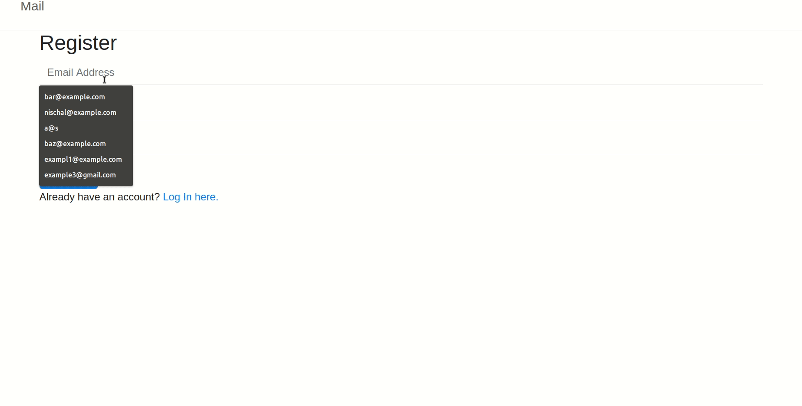
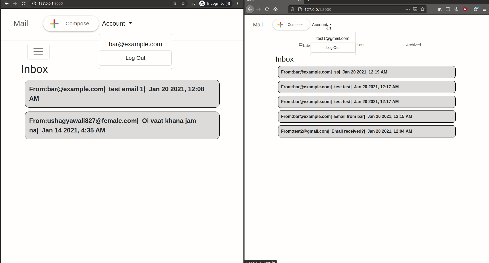

# Email-Service
Email service made with javascript and python

# Motivation 
A webapp inspired from CS50 Web Programming with Python and Javascript's project to practice making website with Django.

You can vist the CS50 specification page [Here](https://cs50.harvard.edu/web/2020/projects/3/mail/)

# Features:
  - Create your account and login.
  - Compose mail and send to valid users.
  - View the inbox and sent emails.
  - Reply to mails in inbox and archive or unarchive it.
 
 
# Demos

## Register and Login 

 
## Compose, Reply, Archive, Inbox, Sent

# Architecture

## Frontend
  - Languages
    - JavaScript
    - HTML
    - CSS
  - Main Framework/Libraries:
    - [Django Templates](https://docs.djangoproject.com/en/3.1/ref/templates/language/)
    - [Bootstrap](https://getbootstrap.com/)

## Backend 
  - Language:
    - Python
  - Main Framework/Libraries:
    - [Django Templates](https://www.djangoproject.com/)
  - Database
    - [SQLite](https://www.sqlite.org/index.html)
    